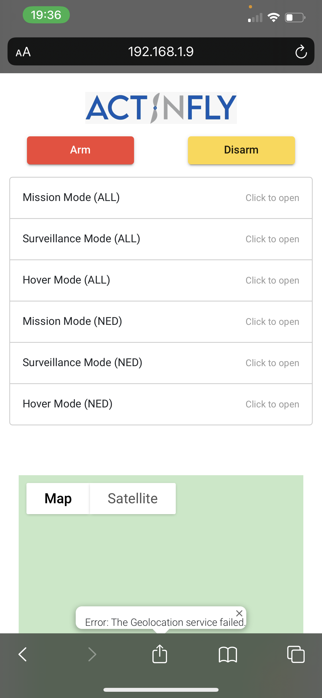
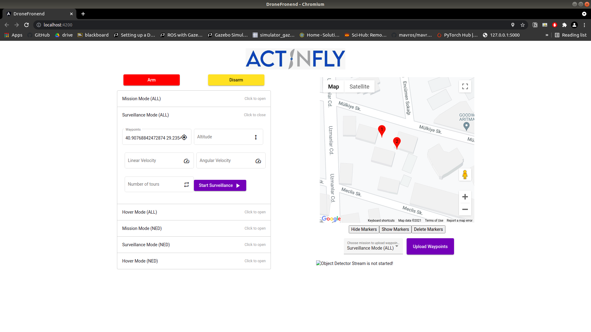
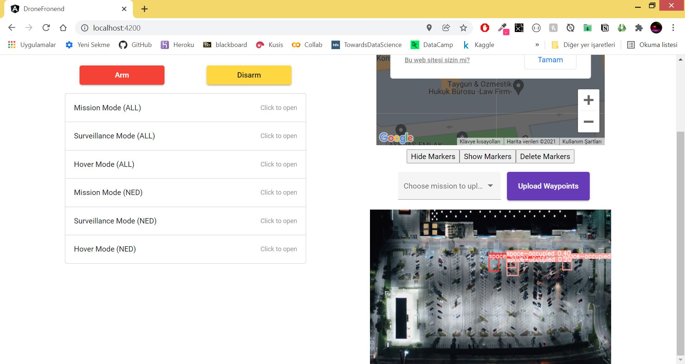
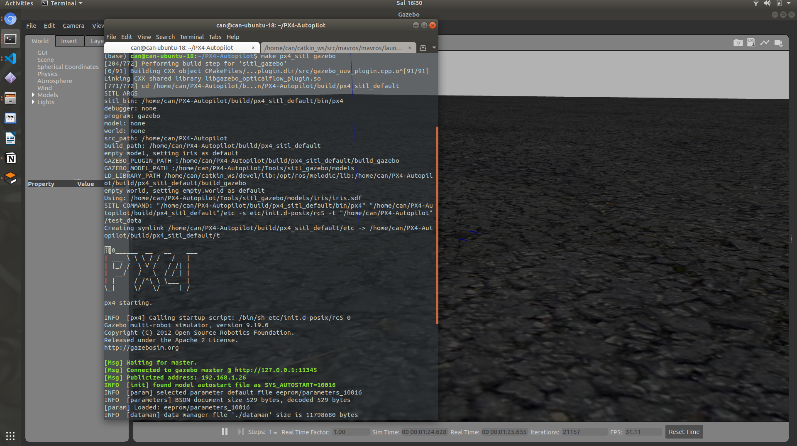
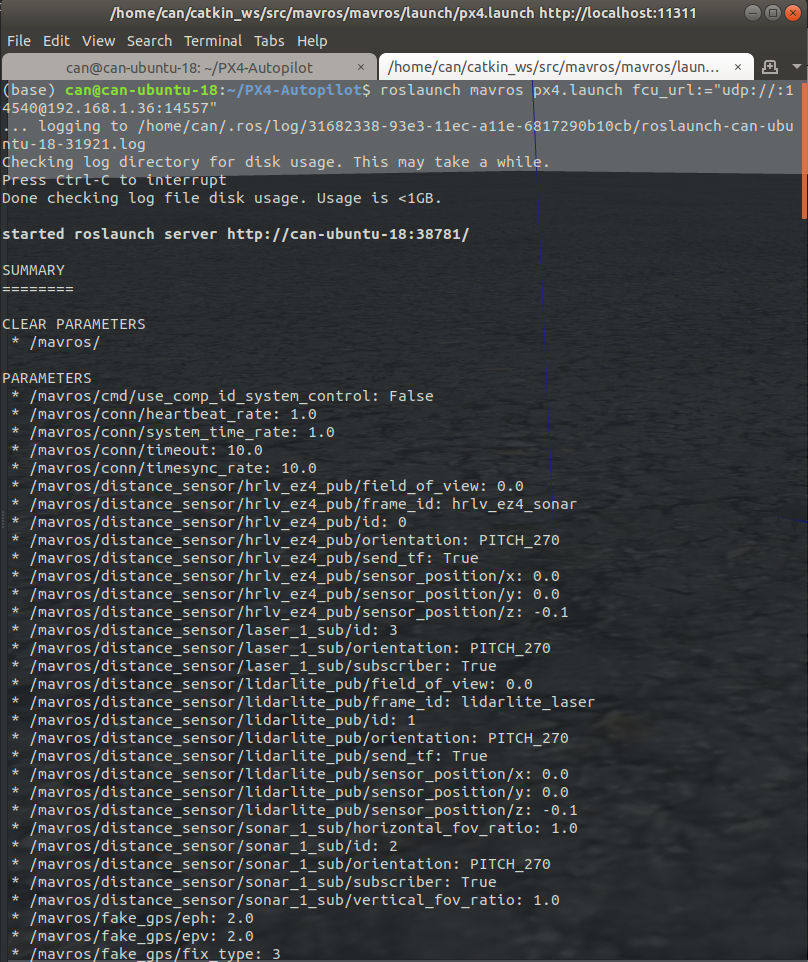
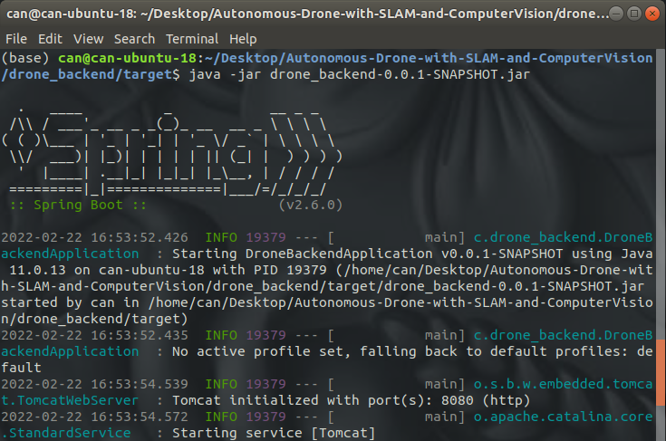
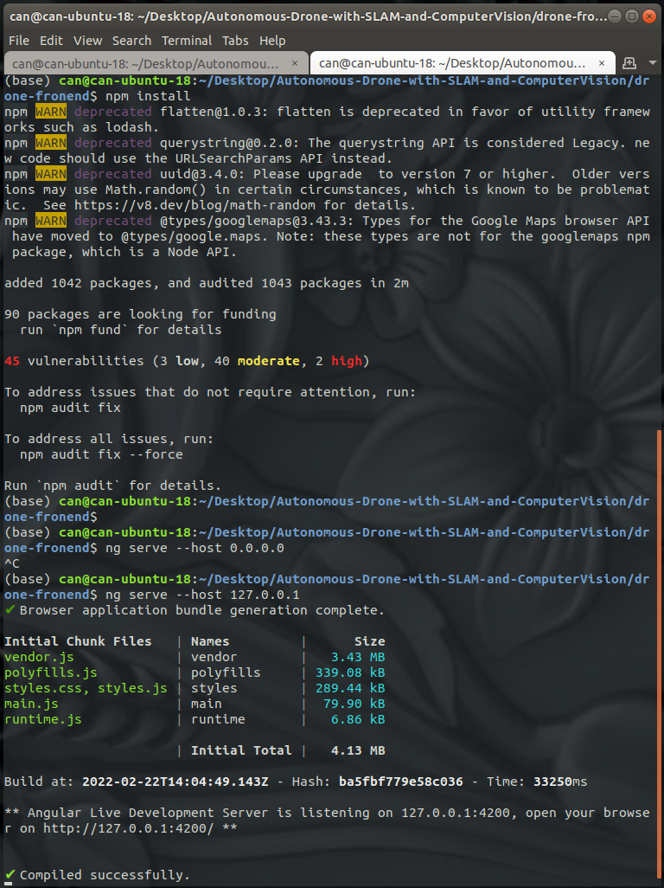
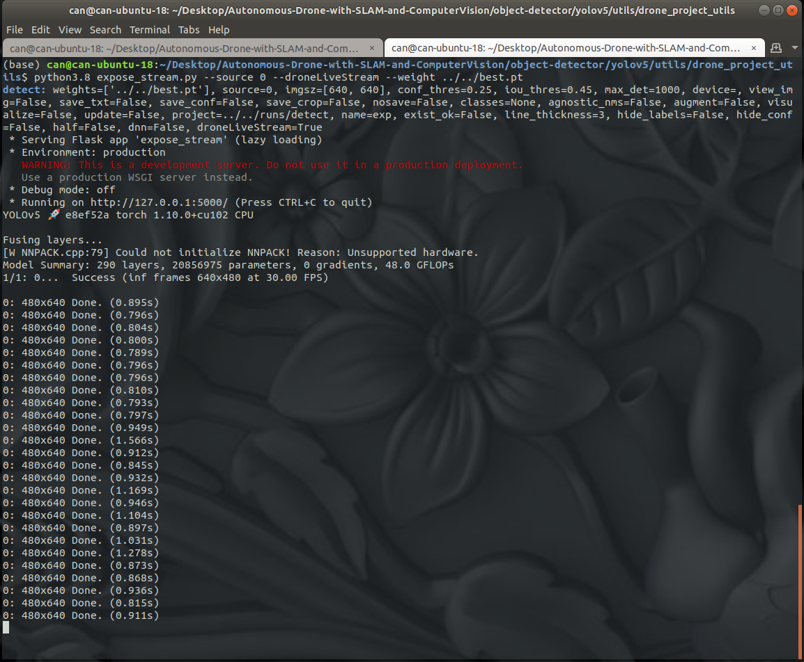

# Autonomous Drone Positioning and Real-time Object Detection

* This Repository contains my term long course project for my Electrical and Electronics Engineering Double Major. This project was sponsored by Actinfly.

---
This repository is tested with px4 compatible flight controller (Pixhawk 4) and used Jetson Nano as on-board computer to run the following code simultaneously. The project contains a web page (Angular 2+ & Java Spring Boot & Flask) which is used by the end-user to monitor/control the drone. There are custom flight modes available with a responsive web page design that the user can use to interact with the drone in real time. This web page allows users to initiate custom flight actions from the drone and simultaneously observe the output of the annotated real time footage (car occupancy detector) received from the camera mounted on the drone in real-time. The Jetson nano board is mounted on the drone. This board is connected to Pixhawk 4 flight controller (configured to communicate using MAVLINK) and any usb camera. Upon successful installation of the hardware one can clone this repository to the on-board computer and benefit from the functionalities offered by this project by only interacting over the web-page that is served on the Jetson Nano. For further investigation of the project you can check out the "Project Report.pdf".   

---
## Content:
    
    1. Single-shot Deep Learning based Computer Vision Algorithm for the detection of occupancy of the car parking spaces that are visible to the camera mounted on the drone in real time.
    
    2. Custom control scripts for autonomously controlling the drone.
    
    3. Platform independent web page for autonomously controlling the drone. 
    
---
## Folder Structure:

1. **drone_backend** -> 
    
    > Contains backend (Java Spring Boot) code for calling custom flight modes that are available in the **python_control_scripts** folder from the web-page.

2. **drone-fronend** -> 
    
    > Contains the front-end (Angular 2+) code for the web-page. This is a single page website. Contains custom flight mode configurations and displays the output of the car occupancy detection results in real time.
    *Note: You have to paste your own Google Maps API key into this folder in order to be able to use the customized Google Maps available on the web-page to input LLA coordinates easily.*

3. **object-detector** -> 

    > Contains the code for the Deep object detection model (modified version of YOLO_v5) and the back-end (Flask) code for serving the annotated frames of the real-time video to the web-page in real time. Note that by only changing the model weight available in this folder you can equip your drone with another object detection model and still be able to monitor it using the already existing web-page with no change. The backend code for serving the frames of the annotated real-time video is in the *utils/drone_project_utils* folder.

4. **python_control_scripts** -> 

    > Contains python code that initiates custom flight behaviours from the drone. It uses ROS (1) Kimera and MAVROS for python. Each script in here accepts its corresponding flight parameters as terminal inputs. These scripts are called with the arguments parsed from the web-page by the services available in the *drone_backend* folder.

*For further information and explanation please refer to the comments in the code.*

---

## Results:

* ### Web-site screenshot taken on Iphone 11 Pro Max:

     


* ### Web-site screenshot taken from Iphone 11 Pro Max:

     

* ### Live Object Detector (Car Occupancy Detection) output:

     

* ### Drone equipped with Pixhawk 4 flight controller, usb camera, Jetson Nano board:

     

---

## How to run:
    
1. Start Gazebo Simulation (SITL):
    
    ``` bash
    $ cd /path/to/PX4-Autopilot
    $ make px4_sitl gazebo
    ```
    
    *Check Out https://docs.px4.io/master/en/simulation/gazebo.html for more*

    

2. Launch MAVROS:
    
    ```bash
    $ roslaunch mavros px4.launch fcu_url:="udp://:14540@192.168.1.36:14557"
    ```
    or for using it with Pixhawk 4 controller connected to Jetson Nano over te *telem* port run the following instead:
    ```bash
    roslaunch mavros px4.launch fcu_url:=/dev/ttyUSB0:57600
    ```
    *Check out https://docs.px4.io/master/en/simulation/ros_interface.html for more information. Also note that you might need to modify *fcu_url* parameter for your use case.*

    

3. Start web-page back-end server:
    
    ```bash
    $ cd drone_backend
    $ mvn clean install
    $ cd target
    $ java -jar drone_backend-0.0.1-SNAPSHOT.jar 
    ```
    

    For using the custom Google Maps for LLA coordinate input you should obtain your own API key for the Google Maps and paste yours in the following **_apiKey_** field in **_drone-fronend/src/app/app.component.ts_** file. Location in the file is highlighted in the screenshot below:

    


4. Start web-page front-end server:
    
    ```bash
    $ cd drone-fronend
    $ npm install
    $ ng serve --host 127.0.0.1
    ```
    *You can reach the UI over http://localhost:4200/*. Note that you can reach the same UI using any other machine by replacing the localhost in the URL above with the device's corresponding ip address if you have opened the corresponding ports (e.g. use *ufw* for ubuntu to open ports). *

    

5. Start object detector(Car Occupancy Detector) and its corresponding back-end server:
    
    ```bash
    $ cd object-detector/yolov5/utils/drone_project_utils
    $ python3.8 expose_stream.py --source 0 --droneLiveStream --weight ../../best.pt
    ```

    *Note that here we are using the *best.pt* as the weights for the Object Detector. You can change the Object Detector's behaviour by just changing this weight with your custom YOLO_v5 model's weights and use the already existing functionality without further modification being required.*

    

---